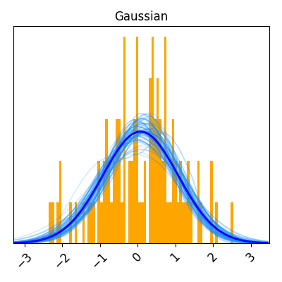
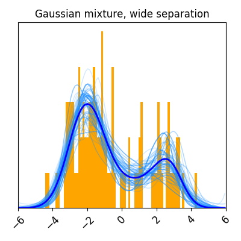
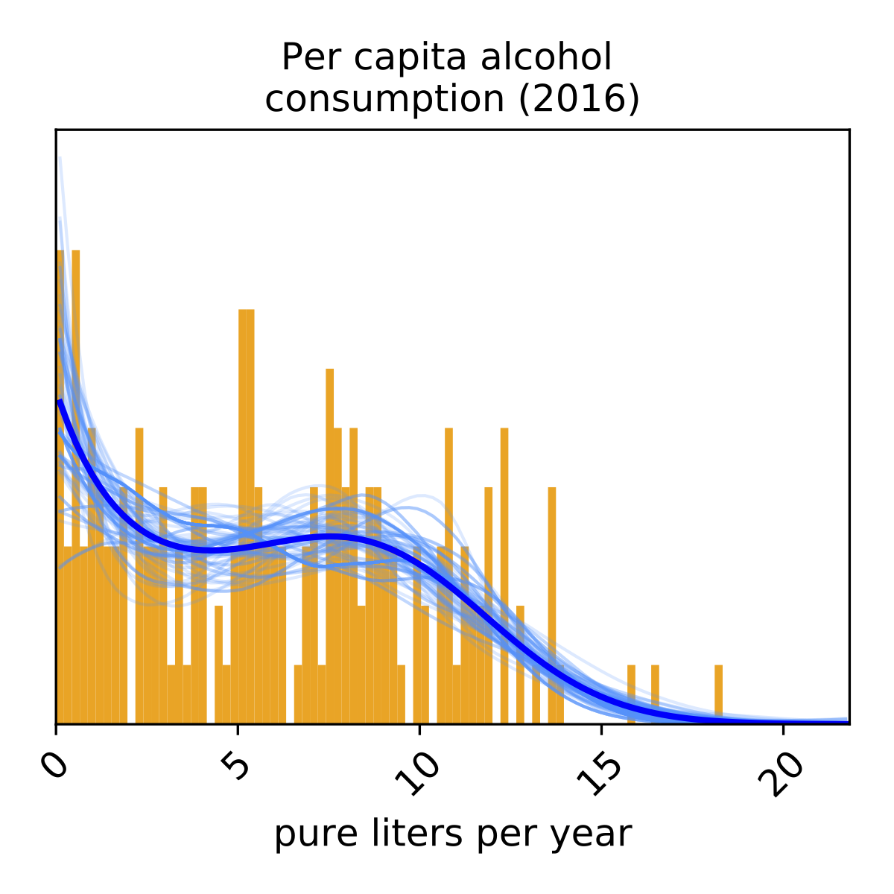

=========
Examples
=========

Custom data
-----------

.. literalinclude:: example_custom.py

Simulated data
--------------

.. literalinclude:: example_wide.py

Real data
---------

.. literalinclude:: example_alcohol.py

